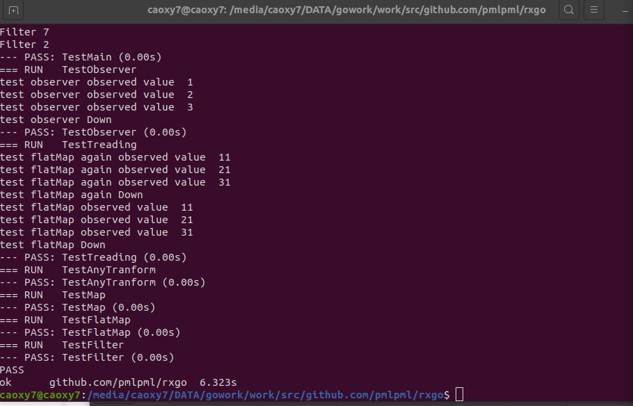

<!-- TOC -->

- [修改、改进RxGo包](#修改改进rxgo包)
    - [简介](#简介)
    - [课程任务](#课程任务)
        - [filtering介绍](#filtering介绍)
        - [Debounce](#debounce)
        - [Distinct](#distinct)
        - [ElementAt](#elementat)
        - [Filter](#filter)
        - [First](#first)
        - [IgnoreElements](#ignoreelements)
        - [Last](#last)
        - [Sample](#sample)
        - [Skip](#skip)
        - [SKipLast](#skiplast)
        - [Take](#take)
        - [TakeLast](#takelast)
    - [测试](#测试)

<!-- /TOC -->

# 修改、改进RxGo包

## 简介

ReactiveX是Reactive Extensions的缩写，一般简写为Rx，最初是LINQ的一个扩展，由微软的架构师Erik Meijer领导的团队开发，在2012年11月开源，Rx是一个编程模型，目标是提供一致的编程接口，帮助开发者更方便的处理异步数据流，，Rx库支持.NET、JavaScript和C++，Rx近几年越来越流行了，现在已经支持几乎全部的流行编程语言了，Rx的大部分语言库由ReactiveX这个组织负责维护。

## 课程任务

实现一组新的操作，filtering

### filtering介绍

> op、opfunc直接复制的pml老师写的

filtering为Observables的其中一种操作，具体需要实现以下几种函数功能


- Debounce — only emit an item from an Observable if a particular timespan has passed without it emitting another item
- Distinct — suppress duplicate items emitted by an Observable
- ElementAt — emit only item n emitted by an Observable
- Filter — emit only those items from an Observable that pass a predicate test
- First — emit only the first item, or the first item that meets a condition, from an Observable
- IgnoreElements — do not emit any items from an Observable but mirror its termination notification
- Last — emit only the last item emitted by an Observable
- Sample — emit the most recent item emitted by an Observable within periodic time intervals
- Skip — suppress the first n items emitted by an Observable
- SkipLast — suppress the last n items emitted by an Observable
- Take — emit only the first n items emitted by an Observable
- TakeLast — emit only the last n items emitted by an Observable

### Debounce

该操作符会过滤掉发生速率过快的数据项。具体实现为通过给定一定的时延若是过了这一段时间还没有新的item到来(在这里表现为count并未改变)，再把之前的那个item输出出去。

```go
// Debounce : 间隔timespan时间输出item；
func (parent *Observable) Debounce(timespan time.Duration) (o *Observable) {

	o = parent.newTransformObservable("Debounce")

	o.flip_accept_error = false
	o.flip_sup_ctx = false
	o.flip = nil
	o.threading = ThreadingComputing
	count := 0
	o.operator = filteringOperator{
		func(ctx context.Context, o *Observable, item reflect.Value, out chan interface{}) (end bool) {
			count++
			var tempCount = count
			//fmt.Printf("Debunce x %d with tempcount %d\n", item.Interface().(int), tempCount)
			time.Sleep(timespan)
			time.Sleep(5 * time.Microsecond)
			//fmt.Printf("Debunce x %d with count %d\n", item.Interface().(int), count)
			if tempCount == count {
				end = o.sendToFlow(ctx, item.Interface(), out)
			}
			return
		}}
	return o
}
```

### Distinct

从名字就看的出来它的作用为将重复的数据过滤掉，使用map数据结构来判断是否之前有出现过。

```go
func (parent *Observable) Distinct() (o *Observable) {
	o = parent.newTransformObservable("distinct")
	o.flip_accept_error = true
	o.flip_sup_ctx = true
	m := map[string]bool{}
	o.operator = filteringOperator{
		opFunc: func(ctx context.Context, o *Observable, item reflect.Value, out chan interface{}) (end bool) {
			itemStr := fmt.Sprintf("%v", item)
			if _, ok := m[itemStr]; !ok {
				m[itemStr] = true
				o.sendToFlow(ctx, item.Interface(), out)
			}
			return false
		},
	}
	return o
}
```

### ElementAt

ElementAt接收一个int类型的变量id，用于选择输入流中的第id个元素进行发射。我们利用count变量记录输入流中的item个数，当输入流中的item个数刚好为id时，发送第iditem；

```go
// ElementAt: 返回位于第id位的元素，从0开始
func (parent *Observable) ElementAt(id int) (o *Observable) {
	o = parent.newTransformObservable("ElementAt")
	o.flip_accept_error = false
	o.flip_sup_ctx = false
	o.flip = nil
	count := 0
	o.operator = filteringOperator{
		func(ctx context.Context, o *Observable, item reflect.Value, out chan interface{}) (end bool) {
			if count == id {
				end = o.sendToFlow(ctx, item.Interface(), out)
			}
			count++
			return
		}}
	return o
}
```

### Filter

这个老师写过了不用写

### First

返回第一个到来的item即可

```go
func (parent *Observable) First() (o *Observable) {
	o = parent.newTransformObservable("first")
	o.flip_accept_error = true
	o.flip_sup_ctx = true
	o.operator = filteringOperator{
		opFunc: func(ctx context.Context, o *Observable, item reflect.Value, out chan interface{}) (end bool) {
			o.sendToFlow(ctx, item.Interface(), out)
			return true
		},
	}
	return o
}
```

### IgnoreElements

直接返回

```go
// IgnoreElements: 忽略所有元素，只发送结束或是错误信息；
func (parent *Observable) IgnoreElements() (o *Observable) {
	o = parent.newTransformObservable("IgnoreElements")
	o.flip_accept_error = false
	o.flip_sup_ctx = false
	o.flip = nil
	o.operator = filteringOperator{
		func(ctx context.Context, o *Observable, item reflect.Value, out chan interface{}) (end bool) {
			return
		}}
	return o
}
```

### Last

Last是要发送最后一项数据，前面说的flip就派上用场了，把它当作一个缓存来使用，实现一定的记忆化。这是因为在监听数据的时候，我们并不知道哪一个是真正的“最后一个”。

```go
func (parent *Observable) Last() (o *Observable) {
	o = parent.newTransformObservable("last")
	o.flip_accept_error = true
	o.flip_sup_ctx = true
	o.operator = filteringOperator{
		opFunc: func(ctx context.Context, o *Observable, item reflect.Value, out chan interface{}) (end bool) {
			o.flip = append([]interface{}{}, item.Interface())
			return false
		},
	}
	return o
}
```

### Sample

Sample就是定期发射Observable最近发射的数据项。为了能够以一定时间间隔范围Observable的输入流，我们选择在opFunc中利用goruntine启动一个定时访问的线程。

```go
// Sample: 定期发射数据
func (parent *Observable) Sample(timespan time.Duration) (o *Observable) {
	o = parent.newTransformObservable("Sample")
	o.flip_accept_error = false
	o.flip_sup_ctx = false
	o.flip = nil
	o.threading = ThreadingComputing
	temp := make([]reflect.Value, 128)
	var hastimer = false
	var count int
	var wg sync.WaitGroup
	count = 0
	o.operator = filteringOperator{
		func(ctx context.Context, o *Observable, item reflect.Value, out chan interface{}) (end bool) {
			temp[count] = item
			count = count + 1
			//fmt.Printf("append: %d\n", item.Interface().(int))
			if !hastimer {
				hastimer = true
				wg.Add(1)
				go func() {
					defer wg.Done()
					for {
						time.Sleep(timespan + 50*time.Millisecond)
						select {
						case <-ctx.Done():
							return
						default:
							if count == 0 {
								return
							}
							//fmt.Printf("sample %d with beforeitem %d\n", temp[count-1].Interface(), count-1)
							if o.sendToFlow(ctx, temp[count-1].Interface(), out) {
								return
							}
							count = 0
						}
					}
				}()
				wg.Wait()
			}
			return false
		}}
	return o
}
```

### Skip

skip作用为跳过前n个。既然是跳过，那么理所当然就用一个count来计数。

```go
func (parent *Observable) Skip(num int) (o *Observable) {
	o = parent.newTransformObservable("skip.n")
	o.flip_accept_error = true
	o.flip_sup_ctx = true
	count := 0
	o.operator = filteringOperator{
		opFunc: func(ctx context.Context, o *Observable, item reflect.Value, out chan interface{}) (end bool) {
			count++
			if count > num {
				o.sendToFlow(ctx, item.Interface(), out)
			}
			return false
		},
	}

	return o
}
```

### SKipLast

跳过后n个

```go
// Skiplast：跳过后n项后再发送
func (parent *Observable) Skiplast(n int) (o *Observable) {
	o = parent.newTransformObservable("Skiplast")
	o.flip_accept_error = false
	o.flip_sup_ctx = false
	o.flip = nil
	var temp []reflect.Value
	var tempcount = 0
	o.operator = filteringOperator{
		func(ctx context.Context, o *Observable, item reflect.Value, out chan interface{}) (end bool) {
			if tempcount == n {
				end = o.sendToFlow(ctx, temp[0].Interface(), out)
				temp = temp[1:]
			} else {
				tempcount++
			}
			temp = append(temp, item)
			return
		}}
	return o
}
```

### Take

选择前n个数据

```go
func (parent *Observable) Take(num int) (o *Observable) {
	o = parent.newTransformObservable("take.n")
	o.flip_accept_error = true
	o.flip_sup_ctx = true
	count := 0
	o.operator = filteringOperator{
		opFunc: func(ctx context.Context, o *Observable, item reflect.Value, out chan interface{}) (end bool) {
			count++
			if count > num {
				return true
			}
			o.sendToFlow(ctx, item.Interface(), out)
			return false
		},
	}

	return o
}
```

### TakeLast

后n个数据
```go
func (parent *Observable) TakeLast(num int) (o *Observable) {
	o = parent.newTransformObservable("takeLast.n")
	o.flip_accept_error = true
	o.flip_sup_ctx = true
	count := 0
	var lasts []interface{}
	o.operator = filteringOperator{
		opFunc: func(ctx context.Context, o *Observable, item reflect.Value, out chan interface{}) (end bool) {
			count++
			if count <= num {
				lasts = append(lasts, item.Interface())
			} else {
				lasts = lasts[1:]
				lasts = append(lasts, item.Interface())
			}
			o.flip = lasts
			return false
		},
	}

	return o
}
```

## 测试

根据函数功能自己距离一段数据然后跟期待之比较即可。

```go
func TestDebounce(t *testing.T) {
	rxgo.Just(0, 1, 2, 3, 4, 5, 6, 7, 8, 9).Map(func(x int) int {
		if x != 0 {
			time.Sleep(1 * time.Millisecond)
		}
		return x
	}).Debounce(2 * time.Millisecond).Subscribe(func(x int) {
		if x != 9 {
			fmt.Printf("error Debounce with %d\n", x)
			os.Exit(-1)
		}
		fmt.Printf("Debunce %d\n", x)
	})
}

func TestDistinct(t *testing.T) {
	var all = map[int]bool{}
	rxgo.Just(0, 1, 2, 3, 6, 5, 6, 2, 3, 9).Distinct().Subscribe(func(x int) {
		if _, ok := all[x]; !ok {
			all[x] = true
			return
		}
		fmt.Printf("error Distinct with %d\n", x)
		os.Exit(-1)
	})
}

func TestElementAt(t *testing.T) {
	rxgo.Just(0, 1, 2, 3, 6, 5, 6, 2, 3, 9).ElementAt(1).Subscribe(func(x int) {
		if x != 1 {
			fmt.Printf("error ElementAt with %d\n", x)
			os.Exit(-1)
		}
	})
}

func TestFirst(t *testing.T) {
	rxgo.Just(0, 1, 2, 3, 6, 5, 6, 2, 3, 9).First().Subscribe(func(x int) {
		if x != 0 {
			fmt.Printf("error First with %d\n", x)
			os.Exit(-1)
		}
	})
}

func TestIgnoreElements(t *testing.T) {
	rxgo.Just(0, 1, 2, 3, 6, 5, 6, 2, 3, 9).IgnoreElements().Subscribe(func(x int) {
		fmt.Printf("error IgnoreElements with %d\n", x)
		os.Exit(-1)
	})
}

/*func TestLast(t *testing.T) {
	rxgo.Just(0, 1, 2, 3, 6, 5, 6, 2, 3, 9).Last().Subscribe(func(x int) {
		if x != 9 {
			fmt.Printf("error Last with %d\n", x)
			os.Exit(-1)
		}
	})
}*/
func TesteLast() {
	rxgo.Just(33, 1, 0, 215, 4, 6).Last().Subscribe(func(x int) {
		fmt.Print(x)
	})
	fmt.Println()
	//Output:6
}

func TestSample(t *testing.T) {
	var samplearr = []int{2, 4, 6, 8, 9}
	var count = 0
	rxgo.Just(0, 1, 2, 3, 4, 5, 6, 7, 8, 9).Map(func(x int) int {
		if x != 0 {
			time.Sleep(500 * time.Millisecond)
		}
		return x
	}).Sample(1 * time.Second).Subscribe(func(x int) {
		if x != samplearr[count] {
			fmt.Printf("error Sample with %d\n", x)
			os.Exit(-1)
		}
		count++
	})
}

func TestSkip(t *testing.T) {
	var skiparr = []int{4, 5, 6, 7, 8, 9}
	var count = 0
	rxgo.Just(0, 1, 2, 3, 4, 5, 6, 7, 8, 9).Skip(4).Subscribe(func(x int) {
		if x != skiparr[count] {
			fmt.Printf("error Skip with %d\n", x)
			os.Exit(-1)
		}
		count++
	})
}

func TestSkiplast(t *testing.T) {
	var skiparr = []int{0, 1, 2}
	var count = 0
	rxgo.Just(0, 1, 2, 3, 4, 5, 6, 7, 8, 9).Skiplast(7).Subscribe(func(x int) {
		if x != skiparr[count] {
			fmt.Printf("error Skiplast with %d\n", x)
			os.Exit(-1)
		}
		count++
	})
}

func TestTake(t *testing.T) {
	var takearr = []int{0, 1, 2}
	var count = 0
	rxgo.Just(0, 1, 2, 3, 4, 5, 6, 7, 8, 9).Take(3).Subscribe(func(x int) {
		if x != takearr[count] {
			fmt.Printf("error Take with %d\n", x)
			os.Exit(-1)
		}
		count++
	})
}
```



感谢同学们的帮助!