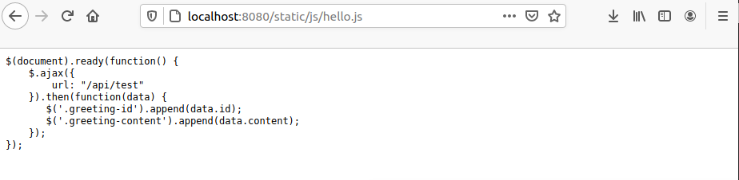
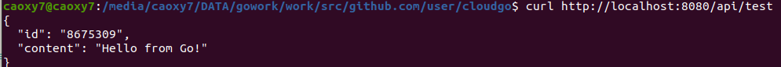
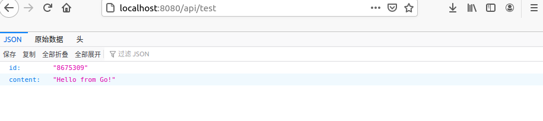
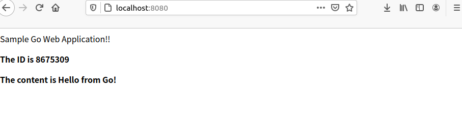
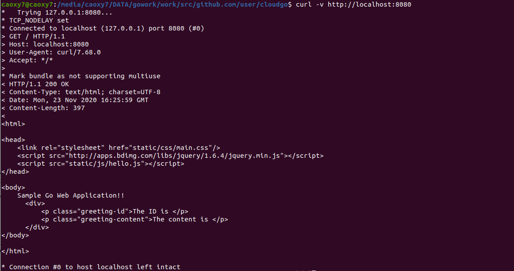

# 开发 web 服务程序

## 编程Web服务程序 类似cloudgo应用

### 支持静态文件服务

根据课件中我们知道了，使用语句`mx.PathPrefix("/").Handler(http.FileServer(http.Dir(webRoot + "/assets/")))`就可以实现静态文件服务，它的含义是将 path 以 “/” 前缀的 URL 都定位到 webRoot + "/assets/" 为虚拟根目录的文件系统。但这里由于文件路径的原因我们需要改动一下文件路径的访问。

```go
mx.PathPrefix("/static").Handler(http.StripPrefix("/static/", http.FileServer(http.Dir(webRoot+"/assets/"))))

```

结果如下：

访问hello.js如下


### 支持简单js访问

同样上可见看，潘老师写的着实详细，添加服务`apitest.go`

```go

func apiTestHandler(formatter *render.Render) http.HandlerFunc {

	return func(w http.ResponseWriter, req *http.Request) {
		formatter.JSON(w, http.StatusOK, struct {
			ID      string `json:"id"`
			Content string `json:"content"`
		}{ID: "8675309", Content: "Hello from Go!"})
	}
}
```

测试输出



结果和预期相同，正确。

通过`hello.js`来访问

```go
$(document).ready(function() {
    $.ajax({
        url: "/api/test"
    }).then(function(data) {
       $('.greeting-id').append(data.id);
       $('.greeting-content').append(data.content);
    });
});

```



### 提交表单，并输出一个表格

## 使用curl测试



## 使用ab测试

## 基础的函数

`server.go`,`main.go`,`handlers.go`这三个函数基本来自于潘老师的课件

```go
//server.go
package service

import (
	"net/http"
	"os"

	"github.com/codegangsta/negroni"
	"github.com/gorilla/mux"
	"github.com/unrolled/render"
)

// NewServer configures and returns a Server.
func NewServer() *negroni.Negroni {

	formatter := render.New(render.Options{
		Directory:  "templates",
		Extensions: []string{".html"},
		IndentJSON: true,
	})

	n := negroni.Classic()
	mx := mux.NewRouter()

	initRoutes(mx, formatter)

	n.UseHandler(mx)
	return n
}

func initRoutes(mx *mux.Router, formatter *render.Render) {
	webRoot := os.Getenv("WEBROOT")
	if len(webRoot) == 0 {
		if root, err := os.Getwd(); err != nil {
			panic("Could not retrive working directory")
		} else {
			webRoot = root
			//fmt.Println(root)
		}
	}

	mx.HandleFunc("/api/test", apiTestHandler(formatter)).Methods("GET")

    mx.PathPrefix("/static").Handler(http.StripPrefix("/static/", http.FileServer(http.Dir(webRoot+"/assets/"))))

	mx.HandleFunc("/", homeHandler(formatter)).Methods("GET")

}

```

```go

//main.go
package main

import (
	"os"

	"github.com/github-user/cloudgo/service"
	flag "github.com/spf13/pflag"
)

const (
	PORT string = "8080"
)

func main() {
	port := os.Getenv("PORT")
	if len(port) == 0 {
		port = PORT
	}

	pPort := flag.StringP("port", "p", PORT, "PORT for httpd listening")
	flag.Parse()

	if len(*pPort) != 0 {
		port = *pPort
	}

	server := service.NewServer()
	server.Run(":" + port)
}

```

```go
//handlers.go
package service

import (
	"net/http"

	"github.com/unrolled/render"
)

func apiTestHandler(formatter *render.Render) http.HandlerFunc {

	return func(w http.ResponseWriter, req *http.Request) {
		formatter.JSON(w, http.StatusOK, struct {
			ID      string `json:"id"`
			Content string `json:"content"`
		}{ID: "8675309", Content: "Hello from Go!"})
	}
}

func homeHandler(formatter *render.Render) http.HandlerFunc {

	return func(w http.ResponseWriter, req *http.Request) {
		formatter.HTML(w, http.StatusOK, "index", struct {}{})
	}
}


```
