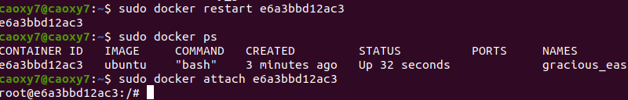

<!-- TOC -->

- [1. DOCKER容器的搭建与mysql](#1-docker容器的搭建与mysql)
    - [1.1. 准备docker环境](#11-准备docker环境)
        - [1.1.1. 安装docker--社区版](#111-安装docker--社区版)
        - [1.1.2. 运行镜像](#112-运行镜像)
            - [1.1.2.1. hello-world](#1121-hello-world)
            - [1.1.2.2. ubuntu](#1122-ubuntu)
            - [1.1.2.3. 其他的基本操作](#1123-其他的基本操作)
    - [1.2. MYSQL与容器化](#12-mysql与容器化)
        - [1.2.1. 拉取mysql镜像](#121-拉取mysql镜像)
        - [1.2.2. mysql容器构建文件Dockerfile](#122-mysql容器构建文件dockerfile)

<!-- /TOC -->
# 1. DOCKER容器的搭建与mysql

## 1.1. 准备docker环境

### 1.1.1. 安装docker--社区版

因为我是ubuntu系统，所以直接看ubuntu的安装流程。

流程基本没什么需要注意的，在这里贴个链接就不细说了。

[官方流程-英](https://docs.docker.com/engine/install/ubuntu/)
[中文教程](https://www.runoob.com/docker/ubuntu-docker-install.html)

### 1.1.2. 运行镜像

#### 1.1.2.1. hello-world

使用`sudo docker run hello-world`执行


#### 1.1.2.2. ubuntu


#### 1.1.2.3. 其他的基本操作




## 1.2. MYSQL与容器化

### 1.2.1. 拉取mysql镜像

这里提一下，建议先把docker换个源，不然巨慢

```
vi /etc/docker/daemon.json
{
    "registry-mirrors": ["http://hub-mirror.c.163.com"]
}
systemctl restart docker.service
```

非常简单就好了

然后进行拉取mysql镜像


### 1.2.2. mysql容器构建文件Dockerfile

照着教程做就好了，没什么注意事项


